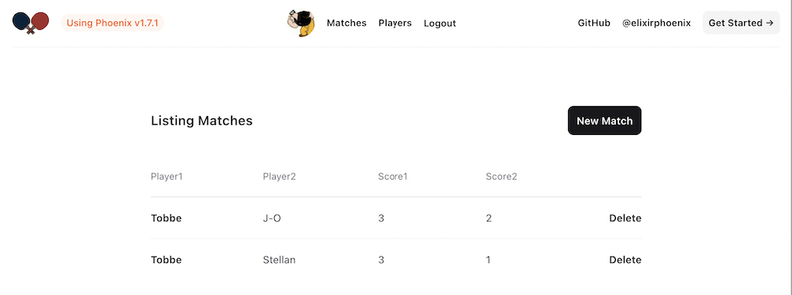
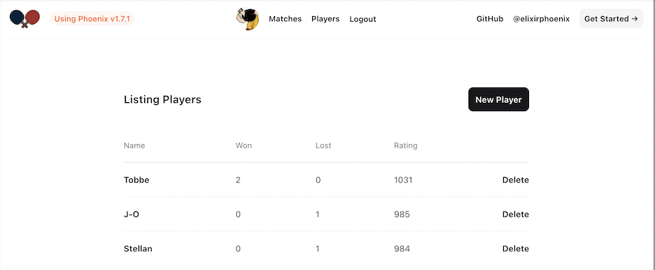

# TableTennis

Revisiting my old Table Tennis Score System, now as a tool
to learn Elixir+Phoenix.

A player can be created by logging in via any of the
GitHub, Twitter or Google authentication providers.

Then matches can be stored between two players.

A rating figure is calculated so that you don't have
to guess who is the best Table Tennis player...

## Install and Run

You need to have Elixir and Postgres installed.

Make sure to configure the Postgres user and password in
the `config/dev.exs` file. You can also change the IP/Port
in this file.

For authentication, see below how to enable it for the various providers.

To start your Phoenix server:

  * Run `mix setup` to install and setup dependencies
  * Start Phoenix endpoint with `mix phx.server` or inside IEx with `iex -S mix phx.server`

Now you can visit [`localhost:4040`](http://localhost:4040) from your browser.

## Github authentication

To setup your own Table Tennis server and make Github login possible
you need to create your OAuth-app at github, see here how to do it:
https://docs.github.com/en/apps/oauth-apps/building-oauth-apps/creating-an-oauth-app

You will need to create a `client-id` and a `client-secret`that you
store in environment variables like this:

    # Client ID and Secret
    export GITHUB_CLIENT_ID=<client-id>
    export GITHUB_CLIENT_SECRET=<client-secret>
    
Don't forget to add your callback URL to the white list.

## Twitter authentication

To setup your own Table Tennis server and make Twitter login possible
you need to create your app at the Twitter developer portal.
Then you need to create the API-Key and Secret and store them
in the environment variables like this:

    # Consumer Keys: API Key and Secret
    export TWITTER_CONSUMER_KEY=<consumer-key>
    export TWITTER_CONSUMER_SECRET=<consumer-secret>
    
You also need to setup your callback URL in a whitelist.
You do that under the `User authentication settings` and it looks
typically like this:

    http://localhost:4040/auth/twitter/callback
    
A website URL is also requested but that can be whatever it seems.

You also need to enable `Request email from users` which will
require you to fill in URL pointing to your `Terms of service`
and `Privacy Policy`.

## Google authentication

Have a look here:
https://www.balbooa.com/gridbox-documentation/how-to-get-google-client-id-and-client-secret

You will need to create a `client-id` and a `client-secret`that you
store in environment variables like this:

    # Client ID and Secret
    export GOOGLE_CLIENT_ID=<client-id>
    export GOOGLE_CLIENT_SECRET=<client-secret>

Don't forget to add your callback URL to the white list.

## Learn more

Ready to run in production? Please [check our deployment guides](https://hexdocs.pm/phoenix/deployment.html).

  * Official website: https://www.phoenixframework.org/
  * Guides: https://hexdocs.pm/phoenix/overview.html
  * Docs: https://hexdocs.pm/phoenix
  * Forum: https://elixirforum.com/c/phoenix-forum
  * Source: https://github.com/phoenixframework/phoenix

## Notes

Here I have some notes I've jotted down
while learning the ropes of this cool framework.

### Overview
Phoenix is a web development framework written in Elixir which
implements the server-side Model View Controller (MVC) pattern.

The Phoenix endpoint pipeline takes a request,
routes it to a controller to access the Model (Business Logic),
which then calls a view module to render a template.

### Model 
The Model will be responsible to host all of your business logic
and business domain. It typically interacts directly with the database.

### Controller
Controllers act as intermediary modules. Their functions,
called actions, are invoked from the router in response to
HTTP requests. The actions, in turn, gather all the necessary
data (e.g from the Model) and perform all the necessary steps
before invoking the view layer. Phoenix controllers also
build on the Plug package, and are themselves plugs.

### View
The view interface from the controller is simple – the controller
calls a view function with the connections assigns, and the
functions job is to return a HEEx template.
We call any function that accepts an assigns parameter and
returns a HEEx template to be a function component.

### Create the project:

    mix phx.new table_tennis
    cd table_tennis
    mix phx.gen.html App Player players name:string won:integer lost:integer rating:integer
    mix phx.gen.html App Match matches player1:string player2:string score1:integer score2:integer
    mix ecto.migrate

### Postgres 

Change the password: 

    ALTER USER <user> WITH PASSWORD '<new-password>';

If POSTGRES table already exist when: `mix ecto.migrate`

    psql -U postgres -c 'DROP DATABASE IF EXISTS table_tennis_dev;'

or perhaps better:

    mix ecto.drop

then:

    mix ecto.create
    
or even better:

    mix ecto.reset

to undo e.g a migration:

    mix ecto.rollback

Working with psql:

    psql table_tennis_dev  -  connect to the
    \dt  -  list tables
    \d players  -  list the fields in the 'players' table

Working with Ecto from the shell:

    alias TableTennis.Repo
    import Ecto.Query
    # Check what SQL is generated
    query = from "players", select: [:name]
    Repo.to_sql(:all, query)
